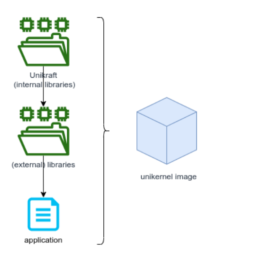

[TOC]


# Session01-BabySteps学习总结


## 基本知识整理

在学习Session01-BabySteps的过程中，我深入了解了Unikraft工作目录的基本布局、环境变量，以及最常见的Unikraft特定文件的含义。我们还学习了如何构建基本应用程序，并通过添加移植的外部库来扩展其功能和支持。

Unikraft是一个unikernel SDK，这意味着它为你提供了构建和运行unikernel(即redis, nginx或sqlite等应用程序)所需的模块(源代码，配置和构建系统，运行时支持)。Unikernel是一个单独的映像文件，可以作为独立的运行实例（通常是虚拟机）加载和运行。



上图中的各部分解析：

- Unikraft: 是核心组件，由多个核心/内部库（每个库提供操作系统中常见的一部分功能）、构建系统以及平台和架构代码组成。它是任何单内核映像的基础。它位于[主 Unikraft 存储库(https://github.com/unikraft/unikraft)](https://github.com/unikraft/unikraft)中

- Libraries: Unikraft还支持多个外部库，这些库将与Unikraft链接，形成最终的映像文件。这些外部库通常是已经移植到Unikraft之上的通用库（例如OpenSSL-加密库、LwIP-TCP/IP网络栈），它们位于Unikraft组织的专用代码库中，名称以lib-开头。

- Application: 应用程序则是实际的应用代码，通常包含main()函数（或等效函数），它依赖于Unikraft和外部库。移植到Unikraft上的应用程序位于Unikraft组织的代码库中，名称以app-开头。

核心的Unikraft组件还提供对不同平台和架构的支持。平台（“Plat”）是用于运行最终映像的虚拟化/运行时环境（例如QEMU、Firecracker、VMWare等）。架构详细说明了将运行最终映像的CPU和内存规格（例如x86、ARM）。

## 实际操作

在学习过程中，我们使用kraft工具来下载、配置、构建和运行unikernel映像。但**注意在实际运行时会因为kvm等原因而无法运行（[这里提到](https://github.com/unikraft/unikraft/pull/760)），因此可能需要使用qemu-system-x86_64等命令来代替。**

实际运行用到的命令：

### 安装 kraft （并验证安装）

```shell
sudo apt-get install -y --no-install-recommends build-essential \
        libncurses-dev libyaml-dev flex git wget socat bison \
        unzip uuid-runtime python3-pip
```

```shell
sudo apt-get -y install qemu-kvm qemu-system-x86
```

```
pip3 install git+https://github.com/unikraft/kraft.git@staging
```

```
UK_KRAFT_GITHUB_TOKEN=<your_GitHub_token> kraft list update
```

这里token获取参考链接：https://docs.github.com/en/github/authenticating-to-github/keeping-your-account-and-data-secure/creating-a-personal-access-token

```
kraft list
```

### 构建并运行 Helloworld 应用程序

#### 使用Kraft up命令一步完成

```
kraft up -t helloworld -p linuxu hello
```

```
ls -Fa hello/
```

```
cd hello/
```

```
kraft run
```

#### 使用Kraft一步步构建

```
mkdir demo
```

```
cd demo/
```

```
mkdir 01-hello-world
```

```
cd 01-hello-world/
```

```
kraft init -t helloworld
```

```
ls
```

```
cat kraft.yaml
```

```
kraft configure (或kraft configure -p linuxu -m x86_64)
```

```
kraft build
```

```
kraft run (或kraft run -p linuxu -m x86_64)
```

### 手动构建 helloworld 应用程序

```
cd ../ && mkdir 01-hello-world-manual && cd 01-hello-world-manual
```

```
git clone https://github.com/unikraft/app-helloworld.git .

ls
```

```
export UK_WORKDIR=~/.unikraft UK_ROOT=~/.unikraft/unikraft UK_LIBS=~/.unikraft/libs
```

```
make menuconfig
```

**注意这里使用make menuconfig中的文字交互界面进行配置，“select”并不能直接选择并改变配置，而是要在相应配置上按“Y”来具体选定，这里详细可以阅读交互界面的英文说明，配置好后记得选择save保存。**
make menuconfig本质就是修改.config配置文件，因此也可以直接修改该配置文件，例如找到并将# CONFIG_PLAT_LINUXU=y修改为CONFIG_PLAT_LINUXU=y，然后就可以正常运行make了，同理可将# CONFIG_PLAT_KVM=y修改为CONFIG_PLAT_KVM=y等

```
make （前面导出了环境变量因此可以直接使用make）
```

```
./build/01-hello-world-manual_linuxu-x86_64
```

```
qemu-system-x86_64 -kernel build/01-hello-world-manual_qemu-x86_64 -nographic
```

**注意CONFIG_PLAT_KVM=y后生成的是01-hello-world-manual_qemu-x86_64，而不是01-hello-world-manual_kvm-x86_64，且需要用该命令运行！**

### 构建并运行 httpreply 应用程序

#### 使用Kraft构建与运行

```
cd demo/

mkdir 02-httpreply

cd 02-httpreply/
```

```
kraft init -t httpreply
```

```
kraft configure -p kvm -m x86_64
```

```
kraft build
```

```
qemu-system-x86_64 -kernel  ./build/httpreply_qemu-x86_64 -nographic
```

**注意这里使用kraft run -p kvm -m x86_64运行会报错，因此我使用该命令来运行对应的映像**

```
sudo brctl addbr virbr0
sudo ip a a  172.44.0.1/24 dev virbr0
sudo ip l set dev virbr0 up
ip a s virbr0
```

```
sudo qemu-system-x86_64 -netdev bridge,id=en0,br=virbr0 -device virtio-net-pci,netdev=en0 -append "netdev.ipv4_addr=172.44.0.2 netdev.ipv4_gw_addr=172.44.0.1 netdev.ipv4_subnet_mask=255.255.255.0 --" -kernel build/httpreply_qemu-x86_64 -nographic
```

**使用教程中的kraft run -b virbr0 "netdev.ipv4_addr=172.44.0.2 netdev.ipv4_gw_addr=172.44.0.1 netdev.ipv4_subnet_mask=255.255.255.0 --"会报错[CRITICAL] list index out of range**

```
wget 172.44.0.2:8123
```

```
sudo ip l set dev virbr0 down

sudo brctl delbr virbr0
```

#### 手动方式构建与运行

```
cd .. && mkdir 02-httpreply-manual && cd 02-httpreply-manual
git clone https://github.com/unikraft/app-httpreply .
```

**注意以下没有按教程步骤而是按https://github.com/unikraft/app-httpreply中的README文档步骤：**

```
cd app-httpreply/
```

```
ls -F
```

```
mkdir .unikraft
```

```
cd .unikraft/
git clone https://github.com/unikraft/unikraft unikraft
mkdir libs
git clone https://github.com/unikraft/lib-lwip libs/lwip
```

```
cd ../
tree -F -L 2 .unikraft/
```

```
UK_DEFCONFIG=$(pwd)/config-qemu-x86_64 make defconfig
```

```
ls .config

（make clean）
```

```
make -j $(nproc)
```

```
sudo mkdir /etc/qemu/
```

```
echo "allow all" | sudo tee /etc/qemu/bridge.conf
```

或

```
sudo mkdir /etc/qemu
cd /etc/qemu
sudo touch bridge.conf
sudo vim bridge.conf
vim中输入：allow all
:wq
```

```
sudo brctl addbr virbr0
sudo ip a a  172.44.0.1/24 dev virbr0
sudo ip l set dev virbr0 up
```

```
sudo qemu-system-x86_64 -netdev bridge,id=en0,br=virbr0 -device virtio-net-pci,netdev=en0 -append "netdev.ipv4_addr=172.44.0.2 netdev.ipv4_gw_addr=172.44.0.1 netdev.ipv4_subnet_mask=255.255.255.0 --" -kernel build/02-httpreply-manual_kvm-x86_64 -nographic
```

```
wget 172.44.0.2:8123
```

```
sudo ip l set dev virbr0 down
sudo brctl delbr virbr0
```

## Practical Work

### 01.Echo-back Server

用 C 语言为 KVM 平台实现一个简单的回显服务器。应用程序能够打开套接字172.44.0.2:1234并将客户端发送到服务器的任何内容发送回客户端。如果客户端关闭连接，服务器端也会自动关闭。

具体实现在./01-echo-back中体现

### 02.ROT-13

更新之前构建的应用程序，以回显rot-13编码消息。在lwip( ~/.unikraft/libs/lwip/) 内创建一个自定义函数，您的应用程序（从新目录work/02-rot13）可以调用该函数来对字符串进行编码。例如，您可以void rot13(char *msg);在内部实现该函。数./lwip/sockets.c并将其标头添加到内部./lwip/include/sys/socket.h。

具体实现在./02-rot13中体现

### 03.Mount 9pfs

参考教程：https://unikraft.org/community/hackathons/sessions/baby-steps/#03-tutorial-mount-9pfs

具体实现在./03-mount-9pfs中体现

### 04. Store Strings

更新第二个任务的源代码，以便它将接收到的字符串存储在文件中，然后再将编码的字符串发送回客户端。

具体实现在./04-store-strings中体现


通过学习Session01-BabySteps，我了解了Unikraft的基本工作原理、核心组件、外部库、应用程序和支持的平台与架构。尝试使用kraft工具构建并运行了unikernel应用程序，为进一步学习Unikraft打下了坚实的基础。