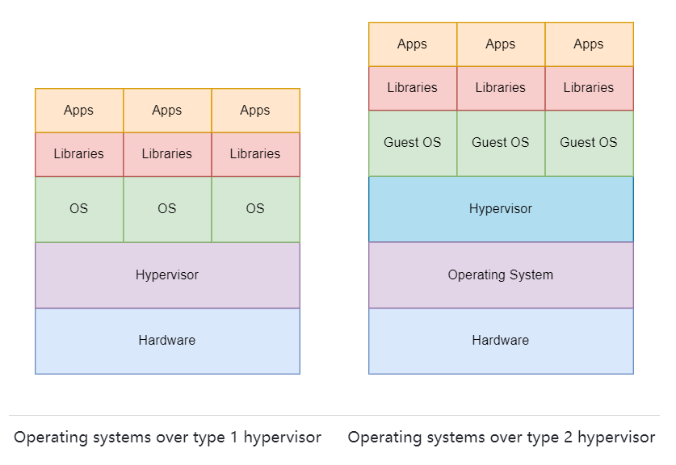
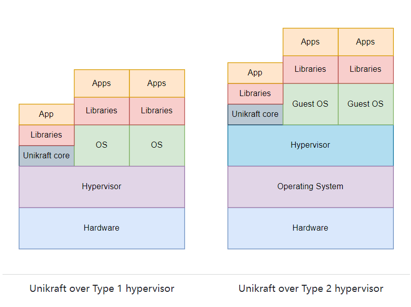
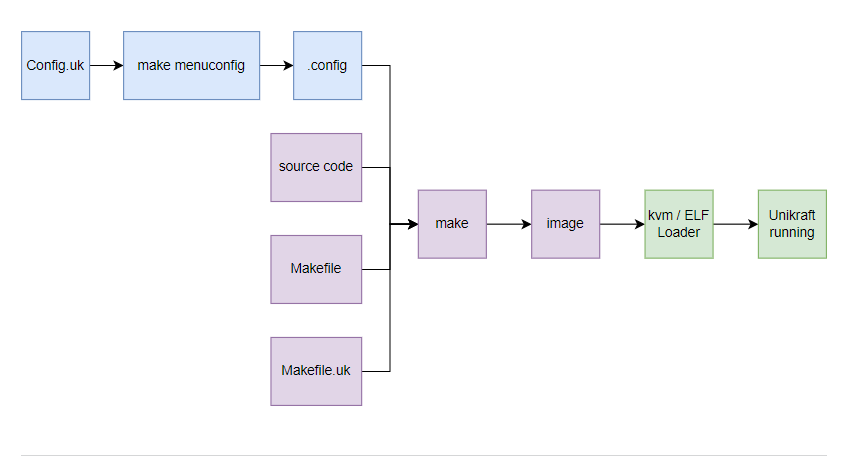

[TOC]

# Session02-BehindtheScenes学习总结

## 基本知识总结

在学习Session02-Behind the Scenes过程中，我深入了解了Unikraft工具和Unikraft内部组件的工作原理。我了解了Unikraft在虚拟化、运行模式、核心组件和libc等方面的工作。

### Kraft简介

Kraft是Unikraft团队开发的工具，旨在简化应用程序部署。通过kraft工具，我们可以自动下载、配置、构建和运行应用程序（如helloworld）。除此之外，如果我们已经使用过Unikraft的克隆/分支存储库，kraft还可以帮助我们配置、构建和运行应用程序。

kraft up命令实际上由三个子命令组成：

- kraft configure
- kraft build
- kraft run。

### Unikraft的优势

在Behind the Scenes中，我们了解了Unikraft的虚拟化方式。**虚拟化技术允许多个操作系统（OS）在同一硬件上独立运行，并认为每个操作系统控制整个系统。**虚拟化可以通过使用低级别软件，即hypervisor（虚拟机监控器），来实现对底层硬件的虚拟化和管理。虚拟机和容器是两种主要的虚拟化环境，Unikraft位于两者之间。虚拟机是对硬件的抽象，容器是专门设计用于运行单个应用程序及其依赖项的环境。

Unikraft的独特之处在于**它的大小与容器相当，同时具备虚拟机的功能，这意味着它可以直接控制硬件组件（虚拟化或不虚拟化）。这使得Unikraft比传统操作系统更具优势。**Unikraft可以作为虚拟机运行在QEMU/KVM或Xen上，也可以作为linuxu构建，表现为Linux用户空间应用程序。

下表对常规虚拟机（例如 Ubuntu VM）、容器和以 Unikraft 为代表的 Unikernel 进行了比较：

### Unikraft的组成与构建

**Unikraft核心（Unikraft Core）由几个组件组成，包括架构代码（[the architecture code](https://github.com/unikraft/unikraft/tree/staging/arch))、平台代码（[the platform code](https://github.com/unikraft/unikraft/tree/staging/plat))和内部库（[internal libraries](https://github.com/unikraft/unikraft/tree/staging/lib)）。**

- **架构代码**:定义了特定目标架构（x86_64、ARM、RISC-V）的行为和硬件交互方式。
- **平台代码**:定义了与底层硬件的交互，根据是否存在虚拟机监控器以及使用哪种虚拟机监控器进行配置。
- **内部库**:定义了独立于硬件的行为，如调度、网络、内存分配和基本文件系统。

Unikraft还需要一个类似于通用操作系统中标准C库的软件层，以便在Unikraft之上轻松运行应用程序。Unikraft提供多个类似于libc的变体，包括nolibc、isrlib、newlibc和musl。其中，**nolibc和isrlib是Unikraft核心的一部分，而newlibc和musl是Unikraft的外部库，需要在构建过程中包含进来**。

Unikraft是一个可配置的操作系统，可以根据用户的需求修改/配置每个组件。这种配置是通过Kconfig版本（在Linux内核中使用）的Config.uk文件完成的。通过在Config.uk文件中添加选项来启用库、应用程序和Unikraft核心的不同组件，然后用户可以使用make menuconfig来应用这些配置选项，生成一个内部配置文件.config，构建Unikraft映像，并使用适当的方法（Linux ELF加载器、qemu-kvm、Xen等）来运行。

Unikraft的构建过程如下图所示：

## Work Items

### 01. Tutorial / Reminder: Building and Running Unikraft

使用基于 Kconfig 的系统为**linuxu**和**KVM**平台、**ARM**和**x86架构构建**helloworld应用程序，然后运行它们。

参考教程一步步走就可以：https://unikraft.org/community/hackathons/sessions/behind-scenes/#01-tutorial--reminder-building-and-running-unikraft

### 02. Tutorial: Make It Speak

启用 Unikraft ( ukdebug) 的内部调试库并使其显示高达info级别的消息。我们还想确定哪些硬件组件被初始化以及在何处初始化。

参考教程一步步走就可以：https://unikraft.org/community/hackathons/sessions/behind-scenes/#02-tutorial-make-it-speak

### 03. More Messages

ukdebug可以选择显示*调试*级别消息。启用它们并针对 ARM 或 x86 架构或两者运行 Unikraft。

具体实现在./03-more-messages中体现

### 04. Going through the Code

Q:获得ukdebug的输出后，浏览unikraft文件夹中的 Unikraft 代码。找到您在输出、平台库以及内核消息发送位置中看到的组件。平台库虽然称为库，但并不位于子lib文件夹中。它被放置在plat文件夹中。找出main函数在哪里被调用？

A:首先，我们需要了解Unikraft的文件结构。根据提供的内容，Unikraft代码有几个关键文件：setup.c，boot.c，_libkvmplat_entry函数以及另外一些构造函数。

在setup.c文件中，硬件组件被初始化。可以在这里找到"uk_pr_{level}"函数的调用，其中"level"可以是Debug, info, warn, err和crit。这些函数调用用于发送内核消息。

在\_libkvmplat_entry函数中，堆栈被更改，并调用\_libkvmplat_entry2函数。_libkvmplat_entry2函数又调用ukplat_entry_argp，其中构造了argc和argv，并调用ukplat_entry。在ukplat_entry函数中，进行软件组件的初始化，包括内存分配器、调度器和参数解析等。

main函数并不会立即被调用，而是在boot.c文件的大约第160行进行了实际的调用。

### 05. I Have an Important Message

在调用 main 函数之前发送每个人都需要看到的重要内核消息。尝试不同的消息级别（严重、错误、警告、信息、调试），看看它们有何不同。

具体实现在./05-important-message中体现

### 06. Tutorial / Reminder: Adding Filesystems to an Application

创建一个简单的 QEMU / KVM 应用程序，用于读取文件并将内容显示到标准输出。本地目录将被挂载为`/`QEMU / KVM 虚拟机内的根目录 ( )。

参考教程一步步进行：https://unikraft.org/community/hackathons/sessions/behind-scenes/#06-tutorial--reminder-adding-filesystems-to-an-application

具体实现在./06-adding-filesystems中体现

### 07. Tutorial: Give the User a Choice

目标是修改[helloworld](https://github.com/unikraft/app-helloworld)应用程序的**Config.uk**，以便用户可以选择应用程序是否显示*Hello world*或从文件中读取的内容。

参考教程一步步进行：https://unikraft.org/community/hackathons/sessions/behind-scenes/#07-tutorial-give-the-user-a-choice

具体实现在./07-give-a-choice中体现

### 08. Tutorial: Arguments from Command Line

配置`helloworld`应用程序以接收命令行参数，然后打印它们。

参考教程一步步进行：https://unikraft.org/community/hackathons/sessions/behind-scenes/#08-tutorial-arguments-from-command-line

### 09. Adding a new source file

为应用程序创建一个新的源文件，并实现一个函数，通过从不同的 libc 变体依次调用来对给定的整数数组进行排序，`qsort()`然后打印该数组。

具体实现在./09-a-new-source-file中体现

### 10. More Power to the User

仅当选择配置选项时才添加包含新的源文件。进行此更改后，应用程序仍然可以构建和运行。

具体实现在./10-more-power中体现

在学习Session02-Behind the Scenes后，我深入了解了Unikraft的背后运行机制，这为进一步了解Unikraft的原理和使用提供了重要的基础。