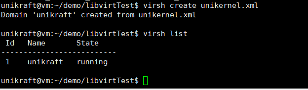
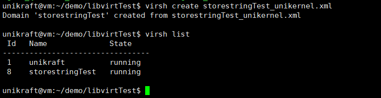
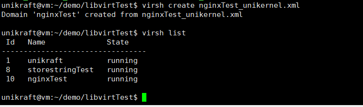

[TOC]


# task2说明文档

## 题目

任务二：使用 Libvirt 管理 Unikraft

主要评分点：

1）Libvirt成功启动虚拟机；

2）Libvirt提供挂载支持；

3）Libvirt提供网络支持

## Libvirt原理介绍

libvirt的架构包括API库、守护进程（libvirtd）和命令行工具（virsh）等部分。守护进程libvirtd可以被本地和远程的virsh调用，通过调用qemu-kvm来操作和管理虚拟机。libvirt的维护者主要由Redhat公司负责维护项目代码和开发。

libvirt的主要功能包括虚拟机生命周期管理（启动、停止、暂停、保存、恢复和迁移等），存储管理（存储池和卷的管理，支持不同格式的文件镜像和共享等），网络管理（物理和逻辑网络接口的管理），以及虚拟NAT和基于路由的网络管理等。它还提供了API来实现状态监控等管理策略。

在libvirt的内部原理中，守护进程libvirtd负责远程代理和本地环境初始化。它根据不同的环境注册各种虚拟化技术的驱动实现，如qemu、xen、storage等。这些驱动统一接口并调用相应的底层命令和接口实现相应功能。而virsh作为libvirt的客户端，提供命令行工具供用户调用，它通过初始化创建连接，并根据函数列表调用具体的函数实现，最终调用API完成相应的操作。

libvirt的API在/usr/include/libvirt/libvirt.h中进行了函数和数据结构的声明，而具体的实现在./src/libvirt.c中。API最终调用各个驱动的实现来实现相应功能，如virDomainCreateXML调用conn->driver->domainCreate()来完成相应的虚拟机创建操作。

libvirt在提供统一的API和管理工具的同时，通过底层驱动和接口实现不同虚拟化技术的管理，从而方便用户对虚拟机、存储和网络等进行统一的管理和操作。

## 文件结构

```
.
│--libvirtTest
	└─04-store-strings_qemu-x86_64
	│--helloworld_qemu-x86_64
	│--nginx_qemu-x86_64
	│--storestringTest_unikernel.xml
	│--unikernel.xml
	│--nginxTest_unikernel.xml
│--img
│--README.md
```

## 项目运行

### 1）Libvirt成功启动虚拟机

先安装libvirt所需的相关依赖包：

```
sudo apt-get update
sudo apt-get upgrade
```

```
sudo apt-get install libvirt-dev libvirt-daemon libvirt-clients libvirt-bin
```

检查是否正常安装与运行：

```
systemctl status libvirtd
```

```
 sudo systemctl is-active libvirtd
```

若该命令显示active，则表示已正常运行。

参考：[Ubuntu 安装 libvirt](https://blog.csdn.net/qingzhuyuxian/article/details/112348144#:~:text=%E9%A6%96%E5%85%88%E6%89%A7%E8%A1%8C%E5%91%BD%E4%BB%A4%E6%9B%B4%E6%96%B0%E8%BD%AF%E4%BB%B6%E5%8C%85%20apt-get%20update%20apt-get%20upgrade%20%E7%84%B6%E5%90%8E%E5%AE%89%E8%A3%85libvirt%20apt-get%20install,libvirt-daemon%20libvirt-clients%20%E5%91%BD%E4%BB%A4%E8%A1%8C%E5%B7%A5%E5%85%B7%EF%BC%9Avirsh%20%E8%BE%93%E5%85%A5virsh%E5%8D%B3%E5%8F%AF%E8%BF%9B%E5%85%A5%E3%80%82%20sudo%20apt-get%20install%20libvirt-bin)  


首先尝试使用libvirt配置文件启动HelloWorld镜像，

使用libvirt管理unikraft，需要使用一个xml文件来定义虚拟机的信息。具体xml文件配置如下所示：

unikernel.xml

```xml
 <!-- 定义虚拟机的类型 -->
<domain type='qemu'>
    <name>unikraft</name>
     <memory unit='KiB'>32000</memory>
    <currentMemory unit='KiB'>32000</currentMemory>
    <!-- 定义虚拟机的虚拟CPU数量为1 -->
    <vcpu placement='static'>1</vcpu>
    <os>
        <type arch='x86_64'>hvm</type>
          <!-- unikernel binary path -->
   		<kernel>/home/unikraft/demo/libvirtTest/helloworld_qemu-x86_64</kernel>
        <boot dev='hd'/>
    </os>
    
    <clock offset='utc' adjustment='reset'/>
    <on_poweroff>destroy</on_poweroff>
    <on_reboot>restart</on_reboot>
    <on_crash>preserve</on_crash>
    <cpu mode='custom' match='exact' check='none'>
        <model fallback='forbid'>qemu64</model>
    </cpu>
    <devices>
        <emulator>/usr/bin/qemu-system-x86_64</emulator>
        <console type='pty'>
            <target type='serial' port='0'/>
        </console>
        <graphics port="-1" type="vnc" />
    </devices>
</domain>
```

注意`<kernel>`处使用helloworld_qemu-x86_64镜像文件，

配置好xml文件后，我们使用以下命令来创建domain：

```shell
virsh create unikernel.xml
```

使用以下命令查看虚拟机是否正常运行：

```
virsh list
```



可以看到名为unikraft的虚拟机正常运行！

### 2）Libvirt提供挂载支持；

尝试使用session 1 baby steps的Practical Work里的Store Strings的Demo构建storestring虚拟机来实现挂载支持与网络支持

storestringTest_unikernel.xml配置：

```xml
 <!-- 定义虚拟机的类型 -->
<domain type='qemu'>
    <name>storestringTest</name>
     <memory unit='KiB'>32000</memory>
    <currentMemory unit='KiB'>32000</currentMemory>
    <!-- 定义虚拟机的虚拟CPU数量为1 -->
    <vcpu placement='static'>1</vcpu>
    <os>
        <type arch='x86_64'>hvm</type>
          <!-- unikernel binary path -->
   		<kernel>/home/unikraft/demo/libvirtTest/04-store-strings_qemu-x86_64</kernel>
        <boot dev='hd'/>
        <cmdline>netdev.ipv4_addr=172.44.0.2 netdev.ipv4_gw_addr=172.44.0.1 netdev.ipv4_subnet_mask=255.255.255.0 --</cmdline>
    </os>
    
    <clock offset='utc' adjustment='reset'/>
    <on_poweroff>destroy</on_poweroff>
    <on_reboot>restart</on_reboot>
    <on_crash>preserve</on_crash>
    <cpu mode='custom' match='exact' check='none'>
        <model fallback='forbid'>qemu64</model>
    </cpu>
    <devices>
  <!-- The network interface connected to the bridge virbr0 -->
        <interface type='bridge'>
            <mac address='00:16:3e:6d:45:d0'/>
            <source bridge='virbr0'/>
            <target dev='unik0'/>
            <model type='virtio'/>
            <address type='pci' domain='0x0000' bus='0x00' slot='0x03' function='0x0'/>
        </interface>
        <filesystem type='mount' accessmode='passthrough'>
            <source dir='/home/unikraft/demo/mount/storestrings/fs0'/>
            <target dir='rootfs'/>
        </filesystem>
         <serial type='pty'>
            <source path='/dev/pts/20'/>
            <target port='0'/>
            <alias name='serial0'/>
        </serial>
        <console type='pty' tty='/dev/pts/20'>
            <source path='/dev/pts/20'/>
            <target type='serial' port='0'/>
            <alias name='serial0'/>
        </console>
        <graphics port="-1" type="vnc" />
    </devices>
</domain>
```

注意`<kernel>`处使用04-store-strings_qemu-x86_64镜像文件，

配置好xml文件后，我们使用以下命令来创建domain：

```
virsh create storestringTest_unikernel.xml
```



可以看到名为storestringTest的虚拟机正常运行！

### 3）Libvirt提供网络支持

尝试跑通nginx来实现Libvirt提供网络支持

nginxTest_unikernel.xml

```xml
 <!-- 定义虚拟机的类型 -->
<domain type='qemu'>
    <name>nginxTest</name>
     <memory unit='KiB'>32000</memory>
    <currentMemory unit='KiB'>32000</currentMemory>
    <!-- 定义虚拟机的虚拟CPU数量为1 -->
    <vcpu placement='static'>1</vcpu>
    <os>
        <type arch='x86_64'>hvm</type>
          <!-- unikernel binary path -->
   		<kernel>/home/unikraft/demo/libvirtTest/nginx_qemu-x86_64</kernel>
        <boot dev='hd'/>
    </os>
    
    <clock offset='utc' adjustment='reset'/>
    <on_poweroff>destroy</on_poweroff>
    <on_reboot>restart</on_reboot>
    <on_crash>preserve</on_crash>
    <devices>
  <!-- The network interface connected to the bridge virbr0 -->
        <interface type='bridge'>
            <source bridge='virbr0'/>
            <target dev='unik0'/>
            <model type='virtio'/>
        </interface>
        <emulator>/usr/bin/qemu-system-x86_64</emulator>
        <filesystem type='mount' accessmode='passthrough'>
            <source dir='/home/unikraft/demo/mount/ngnix/fs0'/>
            <target dir='fs0'/>
        </filesystem>
         <serial type='pty'>
            <source path='/dev/pts/20'/>
            <target port='0'/>
            <alias name='serial0'/>
        </serial>
        <console type='pty' tty='/dev/pts/20'>
            <source path='/dev/pts/20'/>
            <target type='serial' port='0'/>
            <alias name='serial0'/>
        </console>
        <controller type='usb' index='0' model='piix3-uhci'>
            <address type='pci' domain='0x0000' bus='0x00' slot='0x01' function='0x2'/></controller>
        <controller type='pci' index='0' model='pci-root'/>
        <graphics port="-1" type="vnc" />
    </devices>
</domain>
```

注意`<kernel>`处使用nginx_qemu-x86_64镜像文件，

配置好xml文件后，我们使用以下命令来创建domain：

```
virsh create nginxTest_unikernel.xml
```



可以看到名为nginxTest的虚拟机正常运行！