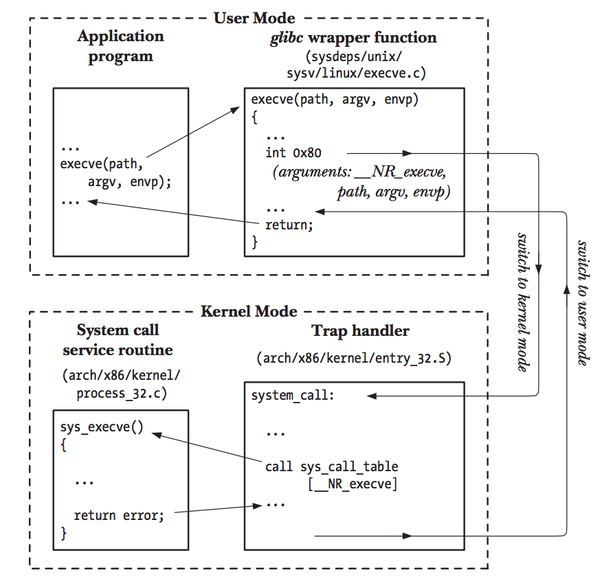
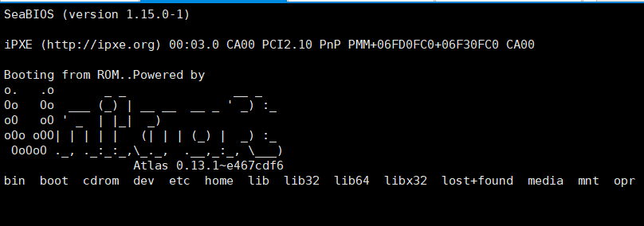
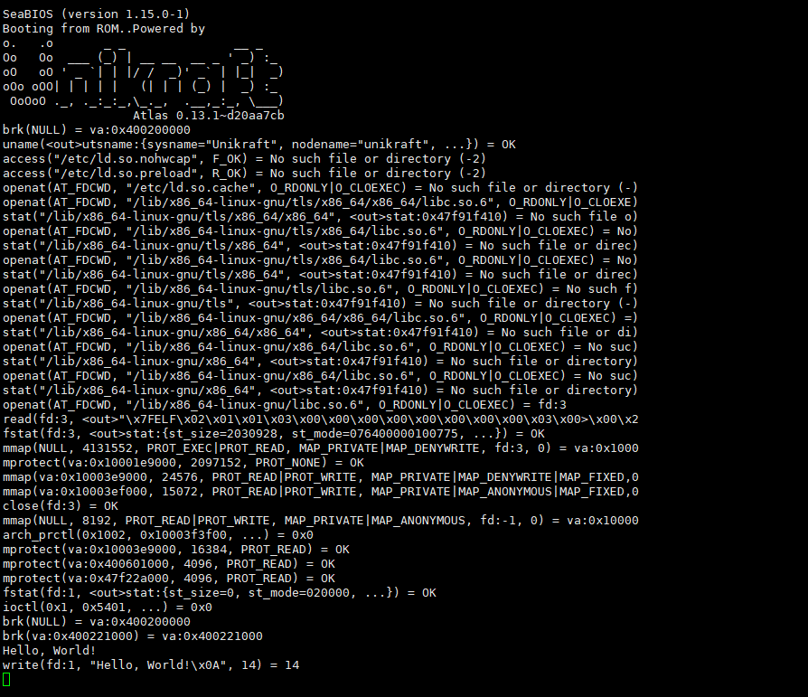

[TOC]


# Task3说明文档

## 题目：

任务三： ELF 场景扩展

主要评分点：

1）实现Unikernel运行期间，以elf加载修改程序功能

加分项：合理的Unikernel结合elf的系统优化场景。

## 文件结构：

```
.
│--elfloader
│--img
│--README.md
```

elfloader文件夹中为实践过程中代码等文件，README.md文件为该任务的文档报告。

## 知识整理总结

在学习过程中，我了解了如何利用二进制兼容性层(**binary compatibility layer**)来运行应用程序，并了解了系统调用shim层的内部工作原理。在尝试使用Unikraft时，将新应用程序移植过来的工作是有挑战性的。通过使用Unikraft的二进制兼容性层，可以使这个过程变得简单。二进制兼容性是指将预先构建的Linux ELF二进制文件在Unikraft上运行，而无需任何移植工作，并保持Unikraft的优势：减少内存占用，高度可配置的库组件。

实现二进制兼容性的关键是确保Unikraft提供类似于Linux内核的ABI（应用程序二进制接口）。这意味着Unikraft必须提供类似于Linux内核的系统调用接口，即POSIX兼容接口。为此，创建了系统调用shim层，它提供了将系统调用号映射到实际系统调用处理函数的功能。

在学习过程中，我们熟悉了配置、构建和运行Unikraft应用程序的步骤，以及Unikraft架构的主要组件。

接着我了解了Unikraft的独特之处。在Linux中，当使用系统调用与操作系统通信，但系统调用会增加应用程序的开销，因为需要在用户空间和内核空间之间进行切换。而在Unikraft中，由于没有内核空间和用户空间的划分，我们不需要进行系统调用，所有操作都可以简单地作为函数调用完成。这是一种优点，因为避免了Linux系统调用带来的开销，但同时也面临着需要支持编译在Linux上的应用程序，这些应用程序依赖于系统调用。

为了实现二进制兼容性，Unikraft需要满足两个主要目标：能够在启动时将Linux ELF二进制文件传递给Unikraft，以及能够将传递的ELF文件加载到内存并跳转到其入口点。为此，我们需要一个ELF加载器。ELF加载器的工作是将可执行文件加载到主内存中。它通过读取ELF格式的可执行文件中的程序头部并采取相应措施来实现。实现二进制兼容性的过程如下：首先，将可执行文件作为初始ram磁盘传递给unikernel。然后，unikernel读取可执行文件段并相应地加载它们。最后，跳转到可执行文件的入口点并开始执行。

此外，我还学习了Unikraft系统调用shim层的实现。系统调用shim层是为了实现与Linux内核相同的系统调用行为。为了注册一个系统调用到系统调用shim层，我们可以使用四个定义宏：UK_SYSCALL_DEFINE、UK_SYSCALL_R_DEFINE、UK_SYSCALL_R6_DEFINE和UK_SYSCALL_R6_E_DEFINE。这些宏分别生成libc样式的系统调用、返回负错误值的原始变体系统调用、返回负错误值的原始6个参数系统调用和libc样式的原始6个参数系统调用。

系统调用服务过程：



通过学习二进制兼容性和Unikraft系统调用shim层的实现，我们对Unikraft的独特特性有了更深入的了解。二进制兼容性使得在Unikraft上运行Linux ELF二进制文件变得简单，而无需进行移植工作。而Unikraft的系统调用shim层则确保了与Linux内核相同的系统调用行为，从而支持编译在Linux上的应用程序。通过掌握这些知识，我们可以更加高效地使用Unikraft来构建和运行unikernel，发挥其轻量级、高度可配置的特点。通过进一步学习和实践，我们可以更好地掌握Unikraft的应用和潜力。

## 实现Unikernel运行期间，以elf加载修改程序功能

### 使用Unikraft运行elfloader程序

安装所需要的依赖包

```
sudo apt install -y --no-install-recommends \
  build-essential \
  sudo \
  libncurses-dev \
  libyaml-dev \
  flex \
  bison \
  git \
  wget \
  uuid-runtime \
  qemu-kvm \
  qemu-system-x86 \
  sgabios
```

```
git clone https://github.com/unikraft/app-elfloader elfloader

cd elfloader/

ls -F
```

```
mkdir .unikraft

cd .unikraft/

git clone https://github.com/unikraft/unikraft unikraft
```

```
mkdir libs

git clone https://github.com/unikraft/lib-lwip libs/lwip

git clone https://github.com/unikraft/lib-libelf libs/libelf
```

```
cd ../
UK_DEFCONFIG=$(pwd)/.config.elfloader_qemu-x86_64 make defconfig

```

```
make -j $(nproc)

sudo /usr/bin/qemu-system-x86_64 \
    -fsdev local,id=myid,path="/",security_model=none \
    -device virtio-9p-pci,fsdev=myid,mount_tag=fs0,disable-modern=on,disable-legacy=off \
    -kernel build/elfloader_qemu-x86_64 -nographic \
    -enable-kvm -cpu host \
    -append /bin/ls
```



可以看到程序成功运行了/bin/ls二进制程序，打印了根目录下的内容。

### 使用run-app-elfloader运行

```console
git clone https://github.com/unikraft/run-app-elfloader
git clone https://github.com/unikraft/static-pie-apps
git clone https://github.com/unikraft/dynamic-apps
```

```console
cd run-app-elfloader/
```

以helloworld程序为例，我们可以使用如下命令运行：

```
./run_app.sh helloworld
```



我们可以看到Helloworld程序成功运行！

### 创建自己的应用程序

创建自己的应用程序或获取现有应用程序，构建它并以二进制兼容模式运行它。可以使用通常用作 bash 命令的简单现有应用程序（例如`/usr/bin/ls`、`/usr/bin/tree`、`/usr/bin/zip`）。

```
cd dynamic-apps/

./extract.sh
```


```console
mkdir my-ls/
cd my-ls/
../extract.sh /usr/bin/ls
cp /usr/bin/ls .
tree .
```

```text
.
|-- lib
|   `-- x86_64-linux-gnu
|       |-- libc.so.6
|       |-- libdl.so.2
|       |-- libpcre2-8.so.0
|       |-- libpthread.so.0
|       `-- libselinux.so.1
|-- lib64
|   `-- ld-linux-x86-64.so.2
`-- ls

3 directories, 7 files
```

```
cd run-app-elfloader

./run.sh -r ../dynamic-apps/ls/ /ls
```

```text
SeaBIOS (version rel-1.16.2-0-gea1b7a073390-prebuilt.qemu.org)
Booting from ROM..TEST nofollow
Powered by
o.   .o       _ _               __ _
Oo   Oo  ___ (_) | __ __  __ _ ' _) :_
oO   oO ' _ `| | |/ /  _)' _` | |_|  _)
oOo oOO| | | | |   (| | | (_) |  _) :_
 OoOoO ._, ._:_:_,\_._,  .__,_:_, \___)
                  Atlas 0.13.1~d20aa7cb
dev  lib  lib64  ls
```

## 合理的Unikernel结合elf的系统优化场景思路

Unikernel结合ELF（Executable and Linkable Format）文件的系统优化场景可以在多个方面实现性能、安全和资源管理等方面的提升。下面是一些个人认为合理的Unikernel结合ELF的系统优化场景：

1. 冷启动优化：Unikernels可以将应用程序和操作系统内核打包成一个独立的镜像，从而减少启动时间。通过使用ELF文件格式，可以在冷启动时直接加载预编译的二进制文件，避免了传统操作系统的启动过程中的初始化和配置步骤，从而显著加速冷启动时间。
2. 热构建优化：Unikernels结合ELF文件格式可以实现快速的热构建。因为ELF文件格式支持代码的共享库，所以构建新的Unikernel镜像时可以重用已编译的库，避免重复编译，从而加快构建过程。
3. 集群下的资源管理：Unikernels在集群环境下可以更加高效地管理资源。由于Unikernels是单个镜像，不需要额外的操作系统，因此可以在虚拟机或容器中运行多个Unikernel实例，实现更高的资源密度，节约资源使用。
4. 安全优化：Unikernels结合ELF文件格式可以实现更好的安全性。因为Unikernels只包含必要的组件，没有冗余代码和不必要的功能，减少了攻击面。此外，Unikernels的内核和应用程序共享相同的地址空间，提供更强的隔离性和安全性。
5. 动态构建：Unikernels结合ELF文件格式支持动态构建，可以在运行时根据需要加载和卸载组件。这种动态构建的特性使得Unikernels更加灵活和轻量，适用于多种场景。
6. 资源优化：Unikernels结合ELF文件格式可以更好地管理资源。由于Unikernels只包含应用程序所需的组件，避免了传统操作系统的冗余组件，减少了内存和存储占用，从而提高了资源利用率。